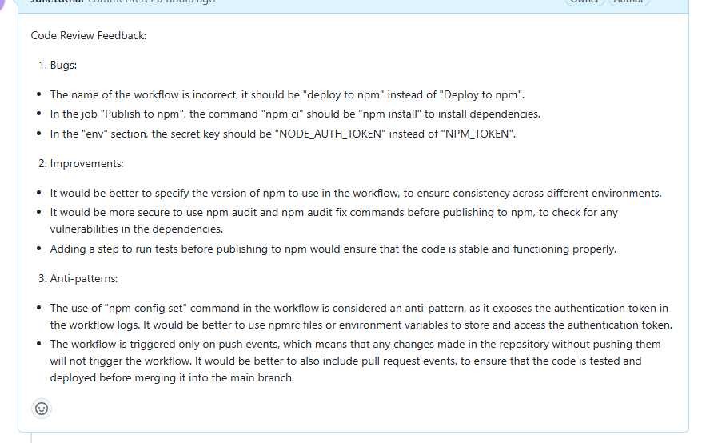

# Reviewer lib
An automated code review tool that uses OpenAI to analyze and provide 
recommendations for code improvement and commenting in PR when received message from AI.

[//]: # (![Forks]&#40;https://img.shields.io/github/forks/JuliettKhar/reviewer-lib&#41;)
[//]: # (![Stars]&#40;https://img.shields.io/github/stars/JuliettKhar/reviewer-lib&#41;)
[//]: # (![Coverage]&#40;https://img.shields.io/codecov/c/github/JuliettKhar/reviewer-lib&#41;)
[//]: # (![Dependencies]&#40;https://img.shields.io/librariesio/release/npm/reviewer-lib&#41;)


## Installation
```shell
npm install -D reviewer-lib
```
## Usage
Notes: Cheaper models give a lower quality result (Davinci, Curie, Ada, Babbage).
To use less expensive models, OpenAI API requests should be directed to instance.submitCode.

```typescript
import { Reviewer} from 'reviewer-lib';

const reviewer = new Reviewer(apiKey); // OpenAI apikey
const code = `
function exampleFunction(x, y) {
  let result = x + y;
  return result;
}
`;

reviewer.submitCodeAssistanceMode(code)
   .then((feedback: string) => {
      console.log('Code Review Feedback:');
      console.log(feedback);
   })
   .catch((error: Error | string) => {
      console.error('Error:', error);
   });
```

in CI/CD:
1. Create file and set up instance. `./review.mjs`
```typescript
import { Reviewer} from 'reviewer-lib';

const apiKey = process.env.OPENAI_API_KEY;
if (!apiKey) {
  console.error('Error: OPENAI_API_KEY is not set');
  process.exit(1);
}

const reviewer = new Reviewer(apiKey);
let code = '';

process.stdin.on('data', chunk => {
  code += chunk;
});
process.stdin.on('end', () => {
  reviewer.submitCodeAssistanceMode(code)
    .then((feedback: string) => {
      console.log('Code Review Feedback:');
      console.log(feedback);
    })
    .catch((error: Error | string) => {
      console.error('Error:', error);
      process.exit(1);
    });
});
```
2. Create workflow. `.github/workflows/code-review.yml`. Add $GITHUB_TOKEN and $OPENAI_API_KEY to your project secrets
```yaml
name: Code Review with ChatGPT

on:
  pull_request:
    branches:
      - master

jobs:
  review:
    runs-on: ubuntu-latest

    steps:
      - name: Checkout repository
        uses: actions/checkout@v2
        with:
          fetch-depth: 2

      - name: Install jq
        run: sudo apt-get install -y jq

      - name: Set up Node.js
        uses: actions/setup-node@v2
        with:
          node-version: '18'

      - name: Install dependencies
        run: npm install

      - name: Get diff from PR
        id: diff
        run: |
          git fetch origin
          git diff origin/master HEAD > pr.diff

      - name: Run code review
        env:
          OPENAI_API_KEY: ${{ secrets.OPENAI_API_KEY }}
        run: |
          npm run build
          node ./review.mjs < pr.diff > review_feedback.txt

      - name: Post review feedback as a comment
        env:
          GITHUB_TOKEN: ${{ secrets.API_GITHUB_TOKEN }}
        run: |
          REVIEW_FEEDBACK=$(cat review_feedback.txt)
          COMMENT_BODY=$(jq -n --arg body "$REVIEW_FEEDBACK" '{body: $body}')
          PULL_REQUEST_NUMBER=${{ github.event.pull_request.number }}
          curl -s -H "Authorization: token $GITHUB_TOKEN" -X POST -d "$COMMENT_BODY" \
            "https://api.github.com/repos/${{ github.repository }}/issues/$PULL_REQUEST_NUMBER/comments"

```
3. Push code. Pipeline should create a job and comment the PR.

## API
`new Reviewer(apiKey, model, maxTokens)`. Creates a new Reviewer instance.
1. Params:
- `apiKey (String)`: Your OpenAI API key.
- `model (String)`: The model you want to use (default 'gpt-3.5-turbo').
- `maxTokens (Number)`: The maximum number of tokens for the response (default 400).
- `code (String)`: The code to analyze. Returns Promise<String>: Suggestions for improving the code.
- `temperature?`: Controls the creativity and variety of the generated text. Values from 0 to 1.
- `n?`: The number of text variants the model should generate. The default value is 1.
- `stop?`: A list of sequences where the generation should stop. For example, ["\n", "END"].
- `top_p?`: Controls cumulative probability sampling. Values from 0 to 1. This is an alternative way to control creativity that focuses on the most likely tokens.
- `frequency_penalty?`: A number from 0 to 1. Reduces the probability of tokens that have already been used in the text. This helps reduce repetition.
- `presence_penalty?`: A number from 0 to 1. Increases the probability of tokens that have not yet been used. This helps introduce new topics and ideas.
- `logprobs?`: If set, returns the logarithms of the probabilities of all tokens when generating. This is useful for analyzing probabilities and choosing the best tokens.
- `echo?`: If set to true, returns the request along with the response. This can be useful for debugging.
- `best_of?`: Generate multiple variants and choose the best one. This is related to n, but allows you to get the best variant from a larger number of generated texts.
- `logit_bias?`: A map of tokens and values to control the probability of certain tokens. This allows you to influence the generation by encouraging or disallowing the use of certain words.
2. Methods:
- `submitCodeAssistanceMode(code: string)`: Function, analyzes and provides recommendations for improving the code.
```typescript
reviewer.submitCodeAssistanceMode(code).then(suggestions => {
  console.log('Review Suggestions:', suggestions);
});
```
Other Functions
- `submitCode(code: string)`: Function, analyzes and provides recommendations for improving the code. Use '/engines/${model}/completions' endpoint.
Work with cheaper models. `Please, note` while using this func with more expensive models, it may not work and throw an error. In this case use `submitCodeAssistanceMode`.
- `getCurrentModels`: Function, gets list of available AI models.
- `historicalAnalysis(repoPath: string)`: A feature that analyzes the history of code changes and makes recommendations for improvements based on past changes.
- `codeStyleRecommendations(code: string)`: Add a feature that provides recommendations for improving code style by following established style guides.
- `securityAnalysis(code: string)`: A function that checks code for potential vulnerabilities and suggests solutions.
- `generateTests(code: string)`: Function for automatic test generation based on provided code.
- `optimizeCode(code: string)`: A function for suggesting optimizations in code in terms of performance and readability.
- `generateDocumentation(code: string)`: A function that automatically generates comments or documentation for code.

### Feedback, integrated ob CI/CD (example)

References
- [Wiki](https://github.com/JuliettKhar/reviewer-lib/wiki)
- [OpenAI prices](https://openai.com/api/pricing/)
- [OpenAI model's deprecations](https://platform.openai.com/docs/deprecations)
