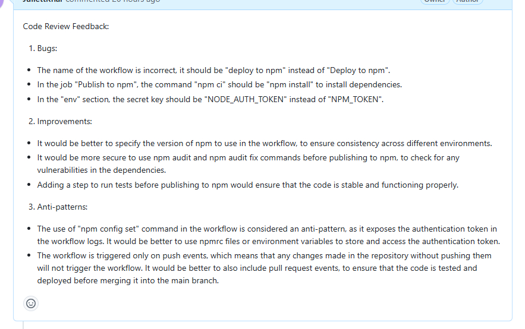

# Reviewer lib
An automated code review tool that uses OpenAI to analyze and provide 
recommendations for code improvement and commenting in PR when received message from AI.

[//]: # (![Forks]&#40;https://img.shields.io/github/forks/JuliettKhar/reviewer-lib&#41;)
[//]: # (![Stars]&#40;https://img.shields.io/github/stars/JuliettKhar/reviewer-lib&#41;)
[//]: # (![Coverage]&#40;https://img.shields.io/codecov/c/github/JuliettKhar/reviewer-lib&#41;)
[//]: # (![Dependencies]&#40;https://img.shields.io/librariesio/release/npm/reviewer-lib&#41;)


## Installation
> Requires Node.js 20+ (the library depends on `openai` v6).
```shell
npm install -D reviewer-lib
```
## Usage
Notes: by default the library uses the OpenAI **Chat Completions** API with `gpt-4o-mini`.
You can pass any chat model (e.g. `gpt-4o`) as the `model` argument. Legacy instruct models
(any name ending in `-instruct`, such as `gpt-3.5-turbo-instruct`) are still supported and
are automatically routed to the older Completions API.

```typescript
import { Reviewer} from 'reviewer-lib';

const reviewer = new Reviewer(apiKey); // OpenAI apikey
const code = `
function exampleFunction(x, y) {
  let result = x + y;
  return result;
}
`;

reviewer.submitCodeAssistanceMode(code)
   .then((feedback: string) => {
      console.log('Code Review Feedback:');
      console.log(feedback);
   })
   .catch((error: Error | string) => {
      console.error('Error:', error);
   });
```

### Structured review (`review`)
`review()` returns typed findings instead of free text (chat models only), ready for
inline PR comments or a CI gate:

```typescript
import { Reviewer, formatFindings, toReviewComments, hasBlockingFindings } from 'reviewer-lib';

const reviewer = new Reviewer(apiKey); // default model: gpt-4o-mini

// Pass asDiff: true to review a unified diff — findings then carry file + line.
const findings = await reviewer.review(diff, { asDiff: true });

console.log(formatFindings(findings));        // markdown summary for a PR comment
const comments = toReviewComments(findings);  // [{ path, line, body }] for GitHub inline comments
if (hasBlockingFindings(findings, 'high')) process.exit(1); // fail CI on high+ severity
```

Each `Finding` has: `severity` (`critical` | `high` | `medium` | `low`), `category`,
`file`, `line`, `message`, and `suggestion`.

### CLI
The package ships a `reviewer-lib` command, so you can review without writing any glue code
(`OPENAI_API_KEY` must be set):

```shell
# review your working changes locally
git diff origin/main | npx reviewer-lib review --fail-on high

# review a diff file as JSON
npx reviewer-lib review --diff pr.diff --format json

# in CI: fetch a PR diff and post inline comments + a summary
#   (needs GITHUB_TOKEN and GITHUB_REPOSITORY)
npx reviewer-lib review --pr 54 --post --fail-on high
```

Flags: `--diff <file>`, `--pr <number>`, `--post`, `--code`, `--model <name>`,
`--format text|json`, `--fail-on <severity>`, `--api-key <key>`, `--timeout <ms>`,
`--max-retries <n>`. Run `npx reviewer-lib --help` for details.

### Use as a GitHub Action
Add AI review to any repository in a few lines. The action reads the PR diff and posts
inline comments plus a summary. Add `OPENAI_API_KEY` to the repo secrets and give the job
`pull-requests: write` permission:

```yaml
name: AI code review
on:
  pull_request:

permissions:
  pull-requests: write

jobs:
  review:
    runs-on: ubuntu-latest
    steps:
      - uses: JuliettKhar/reviewer-lib@v3
        with:
          openai-api-key: ${{ secrets.OPENAI_API_KEY }}
          fail-on: high        # optional: fail the check on high+ findings
```

Inputs: `openai-api-key` (required), `github-token` (default `${{ github.token }}`),
`pr-number` (defaults to the event's PR), `fail-on`, `model` (default `gpt-4o-mini`),
`version` (reviewer-lib version to run, default `latest`).

To trigger it manually instead, use `workflow_dispatch` and pass `pr-number`.

### Local usage (no CI)
Don't want a pipeline? Run reviews straight from your terminal — no install needed
(`npx` pulls the package on demand). Set your key once per shell:

```shell
export OPENAI_API_KEY=sk-...
```

Review your uncommitted changes:
```shell
git diff | npx reviewer-lib review
```

Review a whole branch before opening a PR (everything since `main`):
```shell
git diff main...HEAD | npx reviewer-lib review --fail-on high
```

Review a single file, or get machine-readable output:
```shell
git diff -- src/app.ts | npx reviewer-lib review
git diff | npx reviewer-lib review --format json > review.json
```

Prefer a faster repeat experience? Install it globally: `npm i -g reviewer-lib`, then
drop the `npx`. You can also pass the key inline with `--api-key` instead of the env var.

Optional — review automatically before every push with a git hook. Save as
`.git/hooks/pre-push` and `chmod +x` it:
```sh
#!/bin/sh
git diff origin/main...HEAD | npx reviewer-lib review --fail-on high || {
  echo "reviewer-lib found blocking issues — push aborted (use 'git push --no-verify' to override)."
  exit 1
}
```

## API
`new Reviewer(apiKey, model, maxTokens)`. Creates a new Reviewer instance.
1. Params:
- `apiKey (String)`: Your OpenAI API key.
- `model (String)`: The model you want to use (default 'gpt-4o-mini'). Instruct models (`*-instruct`) route to the legacy Completions API automatically.
- `maxTokens (Number)`: The maximum number of tokens for the response (default 1500).
- `clientOptions (Object)`: Reliability options passed to the OpenAI client — `maxRetries` (default 3) and `timeout` in ms (default 120000). The SDK retries transient failures (429/5xx) with exponential backoff automatically.
- `code (String)`: The code to analyze. Returns Promise<String>: Suggestions for improving the code.
- `temperature?`: Controls the creativity and variety of the generated text. Values from 0 to 1.
- `n?`: The number of text variants the model should generate. The default value is 1.
- `stop?`: A list of sequences where the generation should stop. For example, ["\n", "END"].
- `top_p?`: Controls cumulative probability sampling. Values from 0 to 1. This is an alternative way to control creativity that focuses on the most likely tokens.
- `frequency_penalty?`: A number from 0 to 1. Reduces the probability of tokens that have already been used in the text. This helps reduce repetition.
- `presence_penalty?`: A number from 0 to 1. Increases the probability of tokens that have not yet been used. This helps introduce new topics and ideas.
- `logprobs?`: If set, returns the logarithms of the probabilities of all tokens when generating. This is useful for analyzing probabilities and choosing the best tokens.
- `echo?`: If set to true, returns the request along with the response. This can be useful for debugging.
- `best_of?`: Generate multiple variants and choose the best one. This is related to n, but allows you to get the best variant from a larger number of generated texts.
- `logit_bias?`: A map of tokens and values to control the probability of certain tokens. This allows you to influence the generation by encouraging or disallowing the use of certain words.
2. Methods:
- `submitCodeAssistanceMode(code: string)`: Function, analyzes and provides recommendations for improving the code.
```typescript
reviewer.submitCodeAssistanceMode(code).then(suggestions => {
  console.log('Review Suggestions:', suggestions);
});
```
Other Functions
- `review(input: string, options?: { asDiff?: boolean })`: Structured review returning `Finding[]` via OpenAI Structured Outputs (chat models only). See [Structured review](#structured-review-review) above.
- `submitCode(code: string)`: Function, analyzes and provides recommendations for improving the code. Uses the Chat Completions API by default; if the configured model is an instruct model (`*-instruct`), it routes to the legacy Completions API instead.
- `getCurrentModels`: Function, gets list of available AI models.
- `historicalAnalysis(repoPath: string)`: A feature that analyzes the history of code changes and makes recommendations for improvements based on past changes.
- `codeStyleRecommendations(code: string)`: Add a feature that provides recommendations for improving code style by following established style guides.
- `securityAnalysis(code: string)`: A function that checks code for potential vulnerabilities and suggests solutions.
- `generateTests(code: string)`: Function for automatic test generation based on provided code.
- `optimizeCode(code: string)`: A function for suggesting optimizations in code in terms of performance and readability.
- `generateDocumentation(code: string)`: A function that automatically generates comments or documentation for code.

### Feedback, integrated on CI/CD (example)

References
- [Wiki](https://github.com/JuliettKhar/reviewer-lib/wiki)
- [OpenAI prices](https://openai.com/api/pricing/)
- [OpenAI model's deprecations](https://platform.openai.com/docs/deprecations)
